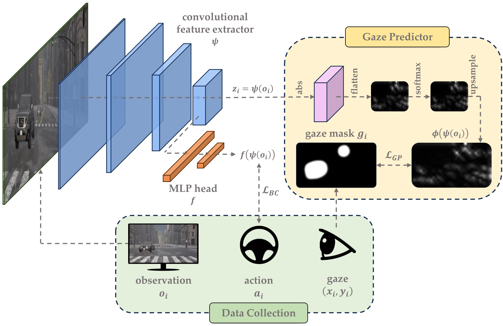

# Official Repository for CARLA Implementation of GABRIL

In this repository, we provide the code and instructions to run **CARLA** experiments from our paper: [**GABRIL: Gaze-Based Regularization for Mitigating Causal Confusion in Imitation Learning**](https://liralab.usc.edu/gabril/).

<p align="center">
  
</p>


## Requirements

Training different BC models is straightforward and rely mostly on ```torch``` and similar python packages. However, to evaluate the trained models, one have to setup **Carla** server before calling the test script. Therefore, we provide full instructions here for both training and evaluating models. 

First, start by manually downloading [CARLA 0.9.15](https://github.com/carla-simulator/carla/releases/tag/0.9.15/) simulator as well as **AdditionalMaps** files, and extract both to a same directory, say ```PATH_TO_CARLA_ROOT```. Then run

```
export CARLA_ROOT=PATH_TO_CARLA_ROOT
export PYTHONPATH="${CARLA_ROOT}/PythonAPI/carla/":"${CARLA_ROOT}/PythonAPI/carla/dist/carla-0.9.14-py3.7-linux-x86_64.egg":${PYTHONPATH}
```
where ```PATH_TO_CARLA_ROOT``` should be replaced with the correct path to the extracted CARLA packages.

Next, clone our repository, create a new conda environemnet and install the required packages:

```
conda create -n python39 python=3.9
conda activate python39

git clone https://github.com/aminbana/GABRIL-CARLA.git
cd GABRIL-CARLA

pip install -r requirements.txt
```

## Dataset 

We used the open-source CARLA 0.9.15 to simulate urban driving. Specifically, we used Leaderboard 2.0 framework to execute scenarios and record data. We leveraged the recently proposed benchmark, Bench2Drive, comprising 44 driving tasks in different towns and weather conditions. Among all, we selected a diverse subset of 10 driving tasks with the highest potential of having causal confusion and collected 20 expert demonstrations with continuous actions for each task. The recordings contain 320x180 RGB images from a front view camera with fov=60°, in addition to the collected gaze coordinates, and the continuous action, including brake, steering angle, and throttle. 

Please download the dataset.zip file [here](https://drive.google.com/drive/folders/1P4NpKcUNFecZxFazlyUULAEPqb3JkAnp) and extract the files to see the following structure:

```bash
GABRIL-CARLA
├── dataset
    ├── bench2drive220
        ├── route_2416
        ├── route_3100
        ├── route_3472
        ...
├── train_bc.py              # main code for training
├── env_manager.py           # main code for evaluating trained models
```

## Pre-Training Gaze Predictor

Some of the gaze-based methods implemented in this repository requires access to a pretrained gaze mask predictor. For example, ViSaRL needs access to an external gaze predictor both during train and test. One can train such gaze predictor as

```
python train_gaze_predictor.py
```

Note that the gaze predictor here is different from the gaze predictor we introduced in our paper. In fact, the gaze predictor here can be seen as a pretraining step, consuming all gaze samples before the main BC training. The pretrained gaze predictor is then frozen and serves as the source of gaze mask generation later during the main traning.

## Training

To train *GABRIL*, run

```
python train_bc.py --result_save_dir=results/GABRIL
```

To train a *regular BC* agent, run

```
python train_bc.py --gaze_method=None --result_save_dir=results/bc
```

To train *GABRIL+GMD*, run

```
python train_bc.py --dp_method=GMD --result_save_dir=results/GABRIL_GMD
```

## Evaluation

For evaluation, first we have to start CARLA server. To that end, run the following command in your terminal and wait for CARLA to load:

```
${CARLA_ROOT}/CarlaUE4.sh -quality-level=Epic -world-port=6000 -carla-rpc-port=3000 &
```

If your system has no display connected, use the ```-RenderOffScreen``` as well. Finally, evaluate the trained models using the ```env_manager.py``` script. For example, to evaluate *GABRIL*, trained using the above commands, run

```
python env_manager.py --agent=BC --params_path=results/GABRIL --seed=100 --routes-id=3100 --video_path=auto --traffic-manager-port=3000 --port=6000
```

Upon completion, you can see the ```stats.json``` file, containing driving score and other stats, as well as the corresponding ```.mp4``` recording file in the ```results/GABRIL``` directory.

## References

* [CARLA](https://carla.org/)
* [Bench2Drive](https://github.com/Thinklab-SJTU/Bench2Drive)
* [Leaderboard v2.0](https://leaderboard.carla.org/get_started_v2_0/)
* [ScenarioRunner](https://github.com/carla-simulator/scenario_runner)
* [OREO](https://github.com/alinlab/oreo)


